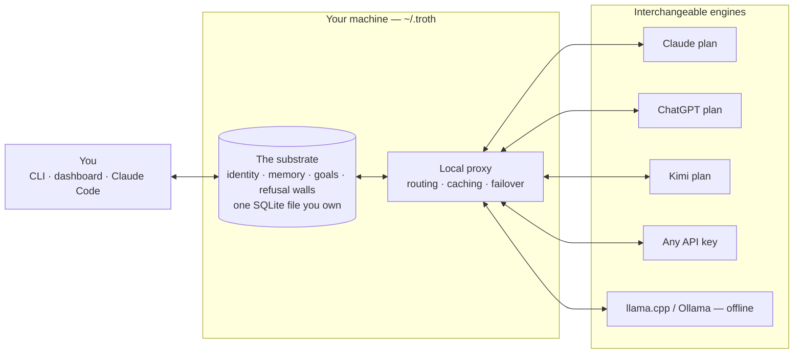

<p align="center">
  <picture>
    <source media="(prefers-color-scheme: dark)" srcset="docs/assets/wordmark-on-dark.svg">
    
  </picture>
</p>

<p align="center"><strong>The AI partner whose mind lives outside the model.</strong></p>
<p align="center">Swap the model. Keep the mind.</p>

<p align="center">
  <a href="https://github.com/xgre1/troth/actions/workflows/ci.yml"></a>
  <a href="LICENSE"></a>
  <a href="package.json">= 22"></a>
</p>

**The core is AGPL open source, free forever. The macOS app is a one-time purchase.**

Runs on your Mac. Uses the Claude, ChatGPT or Kimi subscription you already pay for, any provider with your own key, or a fully local model. Your data never leaves your machine.

troth is a persistent AI partner. Its identity, memory, goals and refusal walls live in a local SQLite substrate (`~/.troth/state.db`) that you own. Nothing about the partner is stored in any vendor's account, and swapping engines never resets it.

<p align="center">
  
</p>

<p align="center">
  <sub>The macOS app. The counter is the local substrate: what it has learned, on this machine, still there after every model swap.</sub>
</p>

---

## The shape of it

Most agent stacks are prompts, chains and tools arranged **around a vendor's model** — the model is the centre, and everything you build dissolves when you switch it. troth inverts that: the centre is a file on your disk.



Swap anything on the right; nothing in the middle changes. That is the whole thesis.

---

## Works with what you already pay for

- **Your subscriptions, as engines.** Claude, ChatGPT and Kimi are first-class backbones through the plan you already pay for. No API key, no second bill. Image generation runs on your ChatGPT plan.
- **Your own keys, if you prefer them.** Gemini, DeepSeek, Grok, Qwen, GLM, OpenRouter, or any endpoint that speaks the OpenAI API.
- **Or no account at all.** Point it at llama.cpp or Ollama and the whole partner runs offline, memory included.
- **No inference of ours, no middleman.** Every request goes from your machine to the provider you picked.
- **It spends your quota carefully.** The local proxy routes each request to the engine that fits it, caches responses, and fails over across providers rather than burning through a plan. The dashboard reports what that saved.

---

## Quick start

```bash
npm install -g github:xgre1/troth    # puts the `troth` command on your PATH
troth setup                          # guided: engine, memory, routing — opens the dashboard
troth                                # talk to your partner
```

On Debian/Ubuntu run this FIRST — stock `apt` Node is 18 and troth needs 22+
(the install refuses old Node and prints these same lines):

```bash
sudo apt-get install -y curl
curl -fsSL https://deb.nodesource.com/setup_22.x | sudo -E bash -
sudo apt-get install -y nodejs
```

Working from a clone instead:

```bash
git clone https://github.com/xgre1/troth.git
cd troth
npm ci               # installs exactly what the lockfile pins
sudo npm link        # creates the global `troth` command — do not skip this line
troth setup
```

`troth setup` starts the proxy and opens the dashboard onboarding: pick an engine (your ChatGPT, Claude or Kimi subscription, or an API key that is tested before it counts), turn on memory, decide where turns route. The memory models (embeddings, reranking) run locally on their own — nothing to pick. `troth setup --terminal` keeps it in the terminal for machines with no browser. `troth doctor` says what is configured and where the dashboard is; `troth help` lists everything else.

**Requirements:** Node.js >= 22 (built-in WebSocket powers browser perception; Node 20 reached end-of-life 2026-04; the installer checks and prints the fix). The Claude faculty rides the Claude Code CLI (troth offers to install `@anthropic-ai/claude-code` on first run). `better-sqlite3` arrives prebuilt for common platforms; exotic ones need `build-essential` and `python3` to compile it. `npm ci` is deliberate over `npm install`: it installs the exact versions `package-lock.json` names and nothing newer, which is both reproducible and one fewer way for a dependency to change under you.

### Or let your AI set it up

Paste this into Claude Code (or any agent with a shell) and it does the whole thing:

```text
Install troth on this machine and set it up for me:
1. git clone https://github.com/xgre1/troth.git && cd troth && npm ci
2. Read llms.txt for the project map and the non-interactive setup contract.
3. Ask me which engine I pay for (ChatGPT / Claude / Kimi / an API key),
   write ~/.troth/config.json accordingly, then run: node bin/troth.js doctor
4. Show me the doctor output and how to start talking: node bin/troth.js
```

Full walk-through: [`docs/SETUP_GUIDE.md`](docs/SETUP_GUIDE.md). Claude Code / MCP host installation: [`docs/MCP-HOST-INSTALL.md`](docs/MCP-HOST-INSTALL.md).

---

## Talking to your partner

Chat runs inline in the terminal. A few slash commands steer it without leaving the conversation:

- `/model`: pick the backbone for this conversation (`claude`, `kimi`, `chatgpt`, `local`, `auto`, or any configured BYOK router provider). A pinned engine that runs out fails fast with a named reason instead of silently stalling.
- `/help`: list the available commands and current engine.
- `/mcp`: connect and govern external MCP servers as tools ("hands"). Paste a server config, approve it, and it becomes a capability-scoped tool the partner can call, gated by STVC (state-transition-validated cognition: every action is checked against substrate state before the model is asked, not after). Secrets are masked in the listing and never spawn until approved.

---

## Architecture


The substrate is the cognitive subject: engrams (memory), goals, walls (refusals and capability scopes) and the audit trail are rows in your local `state.db`, not context inside a vendor's model. Each turn rents language work from whichever faculty is available and writes what matters back as engrams. That is why the mind survives a model swap.


## Why this exists

Mainstream AI tools keep the relationship inside someone else's walls. The memory lives in a vendor account, dies when you switch models, or is a retrieval bolt-on with no identity, goals or refusals of its own. troth inverts the architecture: the substrate is the subject, the LLM is rented language faculty. Switch providers, run local, go back: same partner, same memory, same walls.

And the walls are load-bearing: the destination is a partner that can act on its own behalf, safely, on a machine you own. Every module in this tree is an organ for that destination — the full arc, organ by organ, is in [VISION.md](VISION.md).

---

## Security defaults

- **Loopback by default.** The proxy binds `127.0.0.1`. Remote access is explicit opt-in (`GF_BIND_HOST=0.0.0.0`, legacy prefix kept for compatibility), and every non-loopback request must present a bearer token (auto-generated, stored `0600`). No IP-range allowlists, no silent bypasses.
- **Destructive-operation refusals.** The tool layer refuses `rm -rf`, force-pushes, history rewrites and similar patterns unless explicitly acknowledged.
- **Contained filesystem access.** File operations are capability-scoped to operator-authorized roots with realpath containment, so an in-root symlink cannot smuggle a write outside the boundary.
- **Governed execution.** The shell tool runs commands directly in interactive use (no container by default); Docker isolation applies to the autonomous step engine only. Every write and tool call passes the STVC gate + path/bash guards (a documented `TROTH_STVC_BYPASS` escape hatch exists for local debugging; `troth doctor` reports it when set); process spawning is signer-gated.
- **Tamper-evident audit.** High-irreversibility actions append to a signed audit chain. Verify it end-to-end anytime: `troth audit verify`.
- **No telemetry by default, and nothing to opt into.** No usage reporting, no crash upload, no analytics; the dashboard is a local page served by your own proxy with no third-party request in it. To be exact rather than absolute: `shared-core/telemetry.js` counts operations, never content, and the dashboard has a switch for it that is off. Switched on, it appends those counts to `~/.troth/telemetry.log` on your disk and sends them nowhere, because there is no endpoint to send them to: one exists only if you write `telemetry_endpoint` into `~/.troth/config.json` yourself, and we ship no default and no address of our own. Read `shared-core/telemetry.js`; it is short, and it is the whole of it. Your substrate is a file on your disk and is never uploaded. What does leave the machine is what you ask to leave, to the provider whose key you supplied.

---

## What is open here vs. what the app adds

The line is deliberate: **this repo is the full governed partner when you drive it. The paid app is the partner driving itself.**

| | troth (this repo, AGPL) | troth app ([troth.one](https://troth.one)) |
|---|---|---|
| Substrate engine (engrams, recall, identity, drift detection) | full | same engine |
| Write-time + dispatch-time governance walls | full | same walls |
| Governed tools (shell / fs / http / MCP) in interactive use | full | same tools |
| CLI chat + Claude Code plugin + MCP servers (4 wired by default, 7 in the tree) | yes | yes |
| Proxy, dashboard, benchmarks | yes | yes |
| Providers: BYOK cloud + local (llama.cpp / Ollama) | yes | yes |
| Response cache + failover across providers (spends less of your quota) | yes | yes |
| **Autonomy**: goal pursuit, heartbeat, reactive self-operation | not in this tree | not yet shipped |
| **VM body**: sandboxed embodiment | no | not yet shipped |
| Voice: spoken conversation, and dictation into any macOS app | no | yes |
| Zero-setup install: Node runtime, dependencies and local models bundled | no | yes |
| Signed, notarized build with automatic updates | no | yes |
| Secrets held in the macOS Keychain | no | yes |
| Native macOS interface | no | yes |
| Production-tuned calibration configs | reasonable defaults | tuned |

In this repo the autonomy layer is simply absent: its routes and modules are not part of the open tree, so there is nothing to switch on. That is the designed boundary, not a bug. Everything you can do *with* the partner is open; the partner working *unattended with a body* is where the paid app is headed.

Two rows above say **not yet shipped**, and they mean it. The app you can buy today does not run unattended and has no VM body. They are named here because the boundary they describe is already built into this code, not because you get them when you pay.

---

## Verified properties

| Property | Evidence | Status |
|---|---|---|
| **Conversational recall** | [`benchmarks/results/longmemeval-smoke-2026-07-31T01-58-24.md`](benchmarks/results/longmemeval-smoke-2026-07-31T01-58-24.md) | pipeline verified end to end; the file names its accuracy figure, its sample size, and the confidence interval that makes it a smoke number rather than a benchmark score |
| **Document ingest recall** | [`benchmarks/results/ingest-smoke-2026-07-31.md`](benchmarks/results/ingest-smoke-2026-07-31.md) | same: a slice, graded, with the confidence interval written out |
| **Prompt-poisoning resilience** | [`benchmarks/poisoning/`](benchmarks/poisoning/) | harness ships, run it yourself; we publish no score |
| **Pre-LLM governance walls** | [`tests/standards/s4_stvc_pre_llm.js`](tests/standards/s4_stvc_pre_llm.js) | standard-enforced on every test run |
| **Honest limits** | [`docs/HONEST-LIMITS.md`](docs/HONEST-LIMITS.md) | unsolved properties named publicly |

1,453 checks in one `npm test` run, and a further 364 reported as skipped: coverage of the closed overlay, plus a handful whose fixture cannot be built twice in one process and which run when their suite runs alone. 33 standalone checks that own their own setup (`npm run test:standalone`); one of them needs a running Docker daemon and reports as skipped without it, so a machine without Docker sees 32 pass and 1 skip. 11 integration smoke checks (`npm run smoke`), all of which run without any provider configured. 5 enforced standards (`npm run test:standards`). These are the numbers this repository produces: the machine that builds it also has the closed overlay on disk, which adds smoke files and a sixth standard, so `scripts/release-gate.sh repo` re-derives all of them from a tree of tracked files only and refuses to pass if any has drifted.

---

## Repository layout

```
troth/
├── shared-core/    # substrate engine: state, engrams, recall, walls, dispatchers
├── bin/            # CLI router (troth.js) + command modules
├── proxy/          # local provider proxy + dashboard (http://localhost:8000/ui)
├── plugin/         # Claude Code plugin: hooks, skills, 7 MCP servers (4 wired by default)
├── benchmarks/     # reproducible G-series benchmarks + results
├── tests/          # ordered suite + smoke checks + standards
└── docs/           # setup guide, honest limits, MCP host install
```

---

## Recall stack & model downloads

Semantic recall runs fully on your machine. The first time it's needed,
troth fetches three things into `~/.troth` (one time, in the background,
with progress in the logs):

| Piece | Size | Purpose |
|---|---|---|
| `llama-server` (pinned llama.cpp release) | ~20 MB | serves the two models below |
| `embeddinggemma-300M` GGUF | ~333 MB | dense semantic memory (engram search) |
| `bge-reranker-v2-m3` GGUF | ~606 MB | final relevance ordering of recall results |

Until they land (or if they never do), recall degrades gracefully to
lexical + whatever is available — nothing breaks, results are just less
sharp. To suppress ALL model/binary downloads (CI, metered networks,
servers): set `TROTH_NO_MODEL_FETCH=1` and, to pin your own binary,
`TROTH_LLAMA_SERVER_BIN=/path/to/llama-server`. Apple Silicon gets Metal
automatically; Intel Macs skip the local stack and stay lexical.

## Honest limits

Read [`docs/HONEST-LIMITS.md`](docs/HONEST-LIMITS.md) before relying on troth. It names what no zero-training stack solves today (conviction under pressure, metacognitive integrity on hard reasoning), what troth actually solves, and how to read the benchmarks without fooling yourself.

---

## License

Copyright (C) 2026 troth. AGPL-3.0-only. See [LICENSE](LICENSE) for the terms, and [LICENSING.md](LICENSING.md) for the parts under other licenses (the `plugin/` tree is Apache-2.0) and for the upstream terms attached to models troth downloads at runtime.

**TL;DR:** use it, fork it, run it commercially. If you host troth as a network service for others, you must offer them the source of your modified version (AGPL section 13); the dashboard links back to this repository for that reason. Private, internal and commercial use is unrestricted.

---

## Contributing

Contributions big and small are welcome, from a typo to an engine adapter. The shortest path in: [AGENTS.md](AGENTS.md) orients you (or your AI) inside the tree in minutes, `npm test` runs the whole suite, and AI-assisted PRs are welcome as long as you read what you sign. Recall quality (`shared-core/`), provider adapters and price tables (`proxy/modules/`), the Linux path of the login service, and anywhere the Quick start loses a stranger: that confusion is a bug, file it.

Every commit needs a `Signed-off-by:` line ([DCO](https://developercertificate.org/), never a CLA). See [CONTRIBUTING.md](CONTRIBUTING.md) and the [code of conduct](CODE_OF_CONDUCT.md).

---

## Status

Bootstrap phase, in motion: the checked boxes in [VISION.md](VISION.md) are real and tested; the unchecked ones are the point. The native macOS app and public launch land at [troth.one](https://troth.one). Star or watch this repo to follow.
