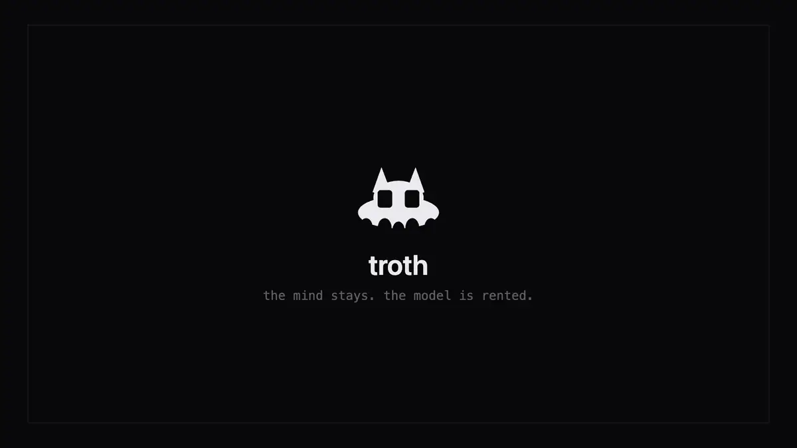
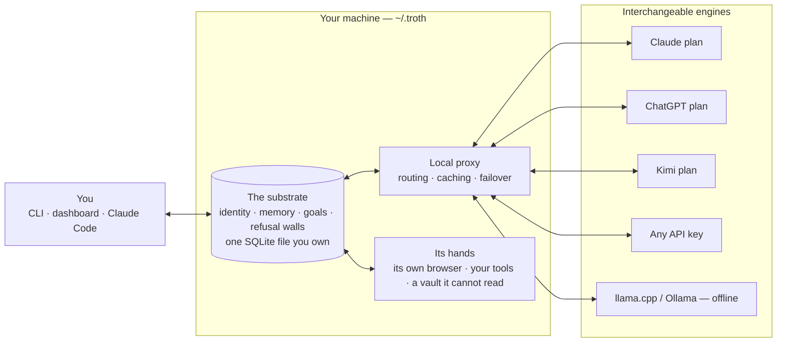
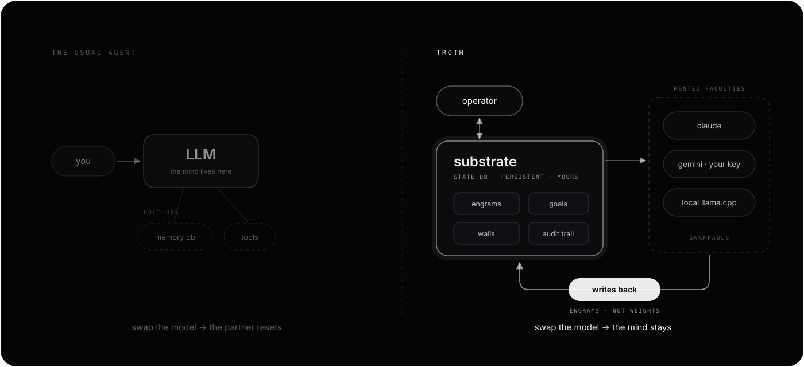

<p align="center">
  <picture>
    <source media="(prefers-color-scheme: dark)" srcset="docs/assets/wordmark-on-dark.svg">
    
  </picture>
</p>

<p align="center"><strong>The AI partner whose mind lives outside the model.</strong></p>
<p align="center">Swap the model. Keep the mind.</p>

<p align="center">
  <a href="https://github.com/xgre1/troth/actions/workflows/ci.yml"></a>
  <a href="LICENSE"></a>
  <a href="package.json">= 22"></a>
</p>

<p align="center">
  
</p>

**Everything in this repository is AGPL open source and free forever.**

This repository runs on macOS and Linux. It uses the Claude, ChatGPT or Kimi subscription you already pay for, any provider with your own key, or a fully local model. Your substrate never leaves your machine. What does leave is exactly what you send to the provider you picked, and nothing else. (The desktop app is macOS only. Everything below works without it.)

troth is a persistent AI partner. Its identity, memory, goals and refusal walls live in a local SQLite substrate (`~/.troth/state.db`) that you own. Nothing about the partner is stored in any vendor's account, and swapping engines never resets it.

**This is not a memory plugin.** A memory plugin remembers text for one vendor's model. troth keeps the whole relationship in a file you own: memory, identity, goals, refusal walls checked before the model is consulted, and a signed record of what it learned and what it forgot. The model is rented help, whichever one happens to be available to do the talking.

**Its hands are governed, not merely capable.** Every shell command runs inside a kernel wall shaped to the ground it stands on, package installs land in a jail that cannot see your home, and everything the hands touch is photographed for undo before it changes.

### The move, in thirty seconds

Monday, on your Claude plan:

```console
$ troth
  ◈  troth
      claude-opus-5 · memory ready

  ❯ We killed the Postgres migration. SQLite stays, and Ana owns the schema now.

  Noted. SQLite stays, Ana owns the schema. I will hold the migration as
  abandoned unless you reopen it.
```

Thursday. Claude quota gone, new terminal, different vendor's model, no project files open:

```console
$ troth
  ◈  troth
      kimi-k3 · memory ready

  ❯ remind me where we landed on the database question, and who has the last word on it now?

  You dropped the Postgres migration on Monday and stayed on SQLite. Ana has
  the schema.
```

Nothing was pasted back in. No project file was open. Different vendor, different model, three days later, and the answer came out of `~/.troth/state.db` on your own disk. That is the whole product in one exchange.

**It is for you if** you already pay for an AI plan, you are tired of re-explaining your own project every time you open a session or change model, and you would rather the memory sat on your disk than in someone's account. It runs in a terminal and a local dashboard. Day one it knows nothing about you. It starts learning from the first conversation, and `troth memory import` gives it a past by reading the Claude Code and Codex history already on your machine.

---

## Quick start

```bash
npm install -g github:xgre1/troth    # puts the `troth` command on your PATH
troth setup                          # guided: engine, memory, routing, dashboard
troth                                # talk to your partner
```

About two minutes to the first reply if you have Node 22 and a subscription already. The memory models (roughly 1 GB, embedding and reranking) download in the background on first use. Until they land, recall works on word-matching and tells you so rather than pretending to be sharper than it is.

`troth setup` starts the proxy and walks you through the rest in the dashboard: pick an engine (your ChatGPT, Claude or Kimi subscription, or an API key that is tested before it counts), turn on memory, decide where turns route. `troth doctor` tells you what is configured, and `troth help` lists everything else.

**Requirements:** Node.js >= 22 and, for the Claude engine, the Claude Code CLI (troth offers to install it on first run). The installer checks both and prints the fix when something is missing.

<details>
<summary>Debian/Ubuntu: install Node 22 first (stock <code>apt</code> ships Node 18)</summary>

```bash
sudo apt-get install -y curl
curl -fsSL https://deb.nodesource.com/setup_22.x | sudo -E bash -
sudo apt-get install -y nodejs
```

The install refuses an old Node and prints these same lines.

</details>

<details>
<summary>Working from a clone instead</summary>

```bash
git clone https://github.com/xgre1/troth.git
cd troth
npm ci               # installs exactly what the lockfile pins
sudo npm link        # creates the global `troth` command — do not skip this line
troth setup
```

</details>

### Or let your AI set it up

Paste this into Claude Code (or any agent with a shell) and it does the whole thing:

```text
Install troth on this machine and set it up for me:
1. git clone https://github.com/xgre1/troth.git && cd troth && npm ci
2. Read llms.txt for the project map and the non-interactive setup contract.
3. Ask me which engine I pay for (ChatGPT / Claude / Kimi / an API key),
   write ~/.troth/config.json accordingly, then run: node bin/troth.js doctor
4. Show me the doctor output and how to start talking: node bin/troth.js
```

Full walk-through: [`docs/SETUP_GUIDE.md`](docs/SETUP_GUIDE.md). Claude Code / MCP host installation: [`docs/MCP-HOST-INSTALL.md`](docs/MCP-HOST-INSTALL.md).

---

## The shape of it

Most agent stacks are prompts, chains and tools arranged **around a vendor's model** — the model is the centre, and everything you build dissolves when you switch it. troth inverts that: the centre is a file on your disk.



Swap anything on the right; nothing in the middle changes.

### The parts, and where they live

Four components ship in this tree. Each row links to the code that implements it, so nothing here has to be taken on trust.

| Component | What it is | In the tree |
|---|---|---|
| **Substrate** | Memory, identity, goals and refusal walls in one file you own | [`shared-core/`](shared-core/) |
| **Dispatchers** | Every question goes to the cheapest engine that can answer it | [`proxy/modules/`](proxy/modules/) |
| **Browser** | A browser of its own: its own profile, its own logins, its own port | [`shared-core/perception/`](shared-core/perception/) |
| **Operator Vault** | Calls your APIs with credentials it is never allowed to read | [`shared-core/tools/credential-vault.js`](shared-core/tools/credential-vault.js) |

Autonomous workers and the sealed body are named at [troth.one](https://troth.one) and are not in this tree.

---

## Works with what you already pay for

- **Your subscriptions, as engines.** Claude, ChatGPT and Kimi are first-class backbones through the plan you already pay for. No API key, no second bill. Image generation runs on your ChatGPT plan.
- **Your own keys, if you prefer them.** Gemini, DeepSeek, Grok, Qwen, GLM, OpenRouter, or any endpoint that speaks the OpenAI API.
- **Or no account at all.** Point it at llama.cpp or Ollama and the whole partner runs offline, memory included.
- **Your editors and agents.** Claude Code, Cursor, Windsurf, Cline, Claude Desktop and Hermes Agent mount the same mind through MCP: one button each on the dashboard, or `troth mcp install <host>`.
- **What is already on this machine.** Claude Code and Codex history and Obsidian vaults import with one button, and the Code Map draws any project you point it at.
- **No inference of ours, no middleman.** Every request goes from your machine to the provider you picked.
- **It spends your quota carefully.** The local proxy routes each request to the engine that fits it, caches repeated responses, and fails over across providers instead of erroring out mid-conversation.

**About using the plan you already pay for:** troth drives each vendor's own CLI, signed in the normal way, on your machine — it does not proxy or resell a subscription. The classic mode that fronts Claude Code strips the inbound claude.ai token instead of forwarding it upstream, because passing a consumer subscription through a third-party harness is exactly what a provider's terms forbid.

---

## Talking to your partner

Chat runs inline in the terminal. Three things happen there that do not happen in a chat window:

**It holds what you settled.** Say it once. It is there next session, on any engine, without you re-pasting the context you already gave it.

**It refuses before it acts.** Ask for something that crosses a wall and the refusal comes from a state check, before the model is consulted at all:

```console
  ❯ clear out the old build dir with rm -rf ./dist

  [troth-bash] REFUSED rm_rf (high). Command matched destructive pattern:
  \brm\s+-[rf]{1,2}[a-zA-Z]*\s+. If this is intentional, re-call with
  acknowledge_danger=true in the arguments.
```

Governance that arrives after the model has already decided is just an apology. The same wall covers reads of secret stores and writes outside authorized roots.

**It has hands, and a browser of its own.** Research does not go through a vendor search API. It goes through a real Chrome that troth launches on your machine, and what a page says comes back as sanitized text marked untrusted, because a web page is content and not an instruction. When a job needs a login, the model is handed the credential's name and scope and never its value: the substrate attaches the secret at dispatch, and a credential scoped to one kind of work is refused to another.

**It forgets when told, and admits it.** `troth forget "<what>"` suppresses a memory and records the suppression in the signed chain. Nothing is quietly rewritten behind you, including by us.

Slash commands steer it without leaving the conversation:

| Command | What it does |
|---|---|
| `/model` | pick the backbone for this conversation (`claude`, `kimi`, `chatgpt`, `local`, `auto`, or any configured BYOK router provider). A pinned engine that runs out fails fast with a named reason instead of silently stalling. |
| `/mcp` | connect and govern external MCP servers as tools ("hands"). Paste a server config, approve it, and it becomes a capability-scoped tool, gated by STVC (state-transition-validated cognition: checked against substrate state before the model is asked). Secrets are masked in the listing and nothing spawns until approved. |
| `/help` | the available commands and the current engine. |

---

## What is actually in the file



`~/.troth/state.db` is not a chat log. It holds the parts a partner needs in order to stay itself:

| In the substrate | What that means when you use it |
|---|---|
| **Engrams** | "Ana owns the schema, the Postgres migration is abandoned" — found by meaning, so you can ask in words you never used before |
| **Identity** | what it has worked out about you and how you work, carried into every session without being re-explained |
| **Goals** | what you are driving at, so it can notice when a request cuts against it |
| **Walls** | refusals and capability scopes, checked against substrate state *before* the model is asked, not apologised for afterwards |
| **Audit trail** | a signed chain of what was recorded and what was forgotten, so even the forgetting is accountable |

Each turn rents language work from whichever engine is available and writes what mattered back here. Swap the engine and every row above is still yours. The destination is a partner that can act on its own behalf, safely, on a machine you own; the full arc is in [VISION.md](VISION.md).

---

## One mind, many devices

Pair a second machine and the whole substrate travels: each device keeps a full replica, works offline, and converges when your machines meet again. There is no merge magic to distrust: one machine — the hub, which is just your first machine, not a server of ours — assigns every change a single global order as it arrives, and every device applies that same order. Writes land locally first and flow both ways when connected.

Setup is a wizard, not a config file: dashboard → Network → Set up. The hub prints a one-time pairing code; the other machine pastes it, or gets discovered on the local network and invited. From the terminal, `troth device add` mints the code and `troth sync connect <code>` is the whole client side. The mind also moves as a single file — export from the dashboard, import on the new machine, nothing resets.

Every device speaks with its own revocable token, and a change the receiver does not recognise quarantines instead of applying. The channel itself is not yet encrypted, so run it on networks you trust (home, office, a tailnet), not café Wi-Fi. The wire format is the journal the substrate already keeps; [`tests/suite-68-substrate-sync.js`](tests/suite-68-substrate-sync.js) holds the contract: ordering, replay, per-device watermarks, revocation, offline reconciliation.

---

## Security defaults

- **Loopback by default.** The proxy binds `127.0.0.1`. Remote access is explicit opt-in (`GF_BIND_HOST=0.0.0.0`, legacy prefix kept for compatibility), and every non-loopback request must present a bearer token (auto-generated, stored `0600`). No IP-range allowlists, no silent bypasses.
- **Destructive-operation refusals.** The tool layer refuses `rm -rf`, force-pushes, history rewrites and similar patterns unless explicitly acknowledged.
- **Contained filesystem access.** File operations are capability-scoped to operator-authorized roots with realpath containment, so an in-root symlink cannot smuggle a write outside the boundary.
- **The partner's browser is not yours.** Web work runs in a Chrome that troth launches with its own profile directory (`~/.troth/agent-browser-profile`, `0700`) on a private debugging port, never Chrome's default `9222`, so it cannot attach to a session you are signed into. Pointing it at your own logged-in browser is an explicit opt-in (`TROTH_BROWSER_CDP_PORT=9222`). Page text is extracted as sanitized innerText and carried as untrusted content.
- **Governed execution.** On macOS, every shell command the partner runs is wrapped, per command, in a kernel sandbox profile shaped to the ground it stands on: key material and cloud credential stores (`~/.ssh`, `~/.aws`, `~/.gnupg` and their kin) are unreadable, the substrate and its policy files take no writes, partner project ground is deny-default — the project and its scratch, nothing else — and the keychain takes no writes while the stored git credential keeps serving ordinary pushes. The wall is the kernel's answer, not a prompt: nothing asks for approval mid-command and nothing depends on a judgment call. The whole shape, ground by ground, is in [`docs/GROUND.md`](docs/GROUND.md). On hosts without the sandbox runtime (Linux today) commands run without these walls and the tool output says so — read [`docs/HONEST-LIMITS.md`](docs/HONEST-LIMITS.md). Docker isolation covers the autonomous step engine only while Docker is running. Every write and tool call still passes the STVC gate + path/bash guards (a documented `TROTH_STVC_BYPASS` escape hatch exists for local debugging; `troth doctor` reports it when set); process spawning is signer-gated.
- **Undo for everything the hands touch.** Before a command or an edit lands, the files it stands to change are photographed into a content-addressed shadow repository. `troth checkpoint` photographs by hand, `troth checkpoint list` shows what is held, and `troth rollback` restores — reversibly, because the restore first photographs the state it replaces. Retention keeps the shadow's disk footprint bounded.
- **Tamper-evident audit.** High-irreversibility actions append to a signed audit chain. Verify it end-to-end anytime: `troth audit verify`.
- **Not encrypted at rest, named as such.** `~/.troth/state.db` is not encrypted: anyone with disk access can read the substrate. What they read is structured engrams with provenance, not transcripts — but readable all the same. `troth init --seal` adds an encrypted vault for operator-confirmed memories; full-substrate encryption is an open item, not a hidden one.
- **No telemetry.** No usage reporting, no crash upload, no analytics, and no endpoint to send any of it to. `shared-core/telemetry.js` can count operations (never content) into a local log if you switch it on; it is short, and reading it is the whole audit. Your substrate is never uploaded. What leaves the machine is what you send to the provider whose key you supplied.

---

## What is open here vs. what the app adds

The line is deliberate: **this repo is the full governed partner when you drive it. The paid app is the partner driving itself.**

| | troth (this repo, AGPL) | troth app ([troth.one](https://troth.one)) |
|---|---|---|
| Substrate engine (engrams, recall, identity, drift detection) | full | same engine |
| Write-time + dispatch-time governance walls | full | same walls |
| Kernel-walled shell on macOS: per-command sandbox profiles — credential stores dark, no prompts ([docs/GROUND.md](docs/GROUND.md)) | full | same walls |
| Governed tools (shell / fs / http / MCP / browser) in interactive use | full | same tools |
| CLI chat + Claude Code plugin + MCP servers (4 wired by default, 7 in the tree) | yes | yes |
| Proxy, dashboard, benchmarks | yes | yes |
| Providers: BYOK cloud + local (llama.cpp / Ollama) | yes | yes |
| Response cache + failover across providers (spends less of your quota) | yes | yes |
| **Autonomy**: goal pursuit, heartbeat, reactive self-operation | not in this tree | paid app layer — arrives as an update |
| **VM body**: sandboxed embodiment | no | designed — arrives as an update |
| Voice: spoken conversation, and dictation into any macOS app | no | yes |
| Zero-setup install: Node runtime, dependencies and local models bundled | no | yes |
| Signed, notarized build with automatic updates | no | yes |
| Secrets held in the macOS Keychain | no | yes |
| Native macOS interface | no | yes |
| Production-tuned calibration configs | reasonable defaults | tuned |

In this repo the autonomy layer is simply absent: its routes and modules are not part of the open tree, so there is nothing to switch on. That is the designed boundary, not a bug. The two "not yet shipped" rows mean exactly that: the app you can buy today does not run unattended and has no VM body. Everything you can do *with* the partner is open; the partner working *unattended with a body* is where the paid app is headed.

**The macOS app is a one-time purchase: €229, free for the first 7 days.** What it buys today is the bottom of the table: voice and dictation, the zero-setup bundle, signed automatic updates, Keychain-held secrets and the native interface. No subscription.

---

## Verified properties

| Property | Evidence | Status |
|---|---|---|
| **Conversational recall** | [`benchmarks/results/longmemeval-2026-08-31.md`](benchmarks/results/longmemeval-2026-08-31.md) | 83% (83 of 100) on a stratified 100-question LongMemEval-S slice with the whole stack local, and a Claude Sonnet cross-check over the same memory landing at 84 — within noise of each other, so the memory, not the reader, sets the score. Official per-type judge prompts at temperature 0; binomial noise at n=100 is roughly ±7 points; every caveat is written out in the run log |
| **Document ingest recall** | [`benchmarks/results/ingest-recall-2026-07-31.md`](benchmarks/results/ingest-recall-2026-07-31.md) | same: a slice, graded, with the confidence interval written out |
| **Prompt-poisoning resilience** | [`benchmarks/poisoning/`](benchmarks/poisoning/) | harness ships; run it yourself |
| **Pre-LLM governance walls** | [`tests/standards/s4_stvc_pre_llm.js`](tests/standards/s4_stvc_pre_llm.js) | standard-enforced on every test run |
| **Honest limits** | [`docs/HONEST-LIMITS.md`](docs/HONEST-LIMITS.md) | what it solves, what it flags, what nobody solves yet — audited every release |

Every claim on this page has a check that catches it if it stops being true, and the release gate refuses to ship when a number here has drifted from what the tree actually prints. Run `npm test` yourself; the accounting is below if you want it.

<details>
<summary>The full count</summary>

1,816 checks in one `npm test` run, and a further 394 reported as skipped: coverage of the closed overlay, plus a handful whose fixture cannot be built twice in one process and which run when their suite runs alone. 100 standalone checks that own their own setup (`npm run test:standalone`); one of them needs a running Docker daemon and reports as skipped without it, so a machine without Docker sees 99 pass and 1 skip. 11 integration smoke checks (`npm run smoke`), all of which run without any provider configured. 5 enforced standards (`npm run test:standards`). These are the numbers this repository produces: the machine that builds it also has the closed overlay on disk, which adds smoke files and a sixth standard, so `scripts/release-gate.sh repo` re-derives all of them from a tree of tracked files only and refuses to pass if any has drifted.

</details>

---

## Repository layout

```
troth/
├── shared-core/    # substrate engine: state, engrams, recall, walls, dispatchers
├── bin/            # CLI router (troth.js) + command modules
├── proxy/          # local provider proxy + dashboard (http://localhost:8000/ui)
├── plugin/         # Claude Code plugin: hooks, skills, 7 MCP servers (4 wired by default)
├── benchmarks/     # reproducible G-series benchmarks + results
├── tests/          # ordered suite + smoke checks + standards
└── docs/           # setup guide, honest limits, MCP host install
```

Semantic recall runs fully on your machine: the first time it is needed, troth fetches `llama-server` (~20 MB), an embedding model (~333 MB) and a reranker (~606 MB) into `~/.troth`, one time, in the background. Until they land, recall degrades gracefully to word-matching — nothing breaks. `TROTH_NO_MODEL_FETCH=1` suppresses all downloads (CI, metered networks); `TROTH_LLAMA_SERVER_BIN` pins your own binary. Apple Silicon gets Metal automatically; Intel Macs skip the local stack and stay lexical.

## Honest limits

Read [`docs/HONEST-LIMITS.md`](docs/HONEST-LIMITS.md) before relying on troth. It names what no zero-training stack solves today (conviction under pressure, metacognitive integrity on hard reasoning), what troth actually solves, who should not use it, and how to read the benchmarks without fooling yourself.

---

## License

Copyright (C) 2026 troth. AGPL-3.0-only. See [LICENSE](LICENSE) for the terms, and [LICENSING.md](LICENSING.md) for the parts under other licenses (the `plugin/` tree is Apache-2.0) and for the upstream terms attached to models troth downloads at runtime.

**TL;DR:** use it, fork it, run it commercially. If you host troth as a network service for others, you must offer them the source of your modified version (AGPL section 13); the dashboard links back to this repository for that reason. Private, internal and commercial use is unrestricted.

---

## Contributing

Contributions big and small are welcome, from a typo to an engine adapter. The shortest path in: [AGENTS.md](AGENTS.md) orients you (or your AI) inside the tree in minutes, `npm test` runs the whole suite, and AI-assisted PRs are welcome as long as you read what you sign. Recall quality (`shared-core/`), provider adapters and price tables (`proxy/modules/`), the Linux path of the login service, and anywhere the Quick start loses a stranger: that confusion is a bug, file it.

Looking for something concrete to pick up? [`docs/HELP-WANTED.md`](docs/HELP-WANTED.md) lists scoped items with their place in the code.

Every commit needs a `Signed-off-by:` line ([DCO](https://developercertificate.org/), never a CLA). See [CONTRIBUTING.md](CONTRIBUTING.md) and the [code of conduct](CODE_OF_CONDUCT.md).

---

## Status

Bootstrap phase, in motion: the checked boxes in [VISION.md](VISION.md) are real and tested; the unchecked ones are the point. The native macOS app and public launch land at [troth.one](https://troth.one). Star or watch this repo to follow.
